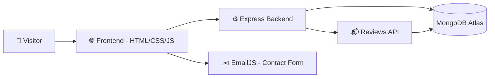
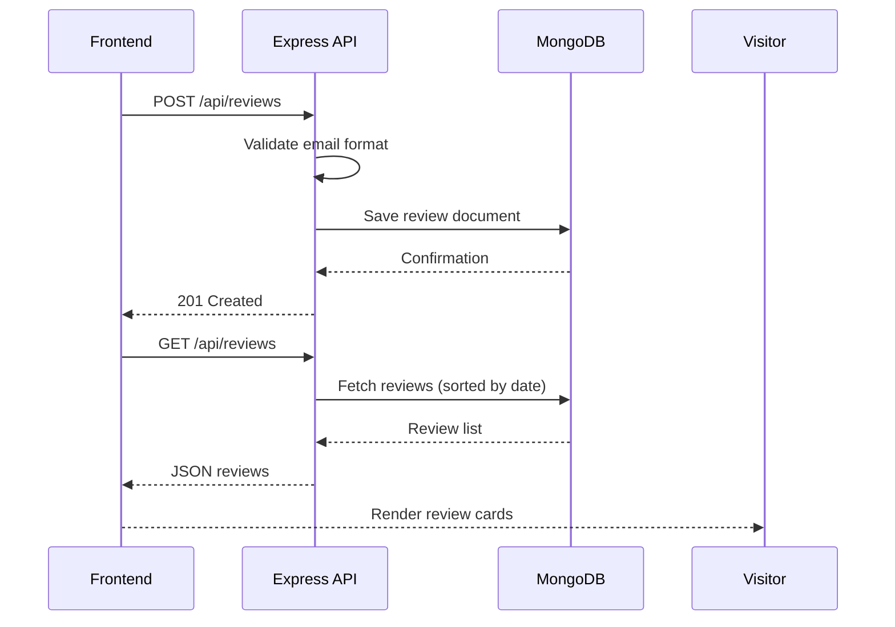

# 💼 Personal Portfolio Website — Satyam Tiwari

A full-stack personal portfolio site with a dynamic, database-backed **Reviews & Ratings** system, an EmailJS-powered contact form, dual resume downloads (SWE / AI-ML focused), dark/light theming, and interactive 3D tilt effects across cards.

Built as a static, animation-rich frontend paired with a lightweight Express + MongoDB backend that persists visitor reviews.

---

## 🔗 Links

| | |
|---|---|
| 🖥️ Live Site | https://satyamtiwari23.github.io/Portfolio/ |
| 💻 GitHub Repo | [Satyamtiwari23/Portfolio](https://github.com/Satyamtiwari23/Portfolio) |
| 💼 LinkedIn | [Satyam Tiwari](https://www.linkedin.com/in/satyam-tiwari-8s5a4t3y8a7m4104/) |
| ✉️ Email | sttiwari9211@gmail.com |

---

## 📌 Why This Project

A portfolio shouldn't just list projects — it should demonstrate full-stack ability on its own. This site pairs a polished, animated frontend with a real backend: a MongoDB-persisted review system that lets visitors leave ratings and feedback, an EmailJS contact form for direct outreach, and role-specific resume downloads so recruiters land on the version most relevant to them.

---

## ✨ Features

### 🏠 Hero & Navigation
- Animated hero section with dual resume downloads — a default **Software Developer** resume and a separate **AI/ML-focused** resume link
- Sticky navbar with smooth-scroll anchor links
- Fully responsive mobile nav with auto-close on link click
- Dark/light theme toggle (persisted via `localStorage`) with icon swap, available on both desktop and mobile nav

### 👤 About Me
- Profile section with 3D tilt-on-hover profile image
- Highlighted achievement bullets (DSA/OOP foundation, full-stack project experience, AI fundamentals)

### 🧩 Featured Projects
- Responsive project grid with tilt-on-hover cards
- Live project cards link out directly (e.g. ResumeIQ, PortfolioPro) with a "Live · Try It" badge
- Tagged tech stacks per project for quick scanning

### 🛠️ Skills & Expertise
- Categorized skill grid: Languages, Frontend, Backend, Database, Core Skills, Tools & Practices

### ⭐ Reviews & Ratings (full-stack)
- Visitors submit name, email, country, service type, star rating, and a written review
- Reviews persist to MongoDB via a REST API and render dynamically with skeleton loading states
- Client-side validation (required rating selection, email format) with success/error messaging

### 📬 Contact
- Contact form wired to **EmailJS** for serverless email delivery — no backend round-trip needed
- Direct contact details (email, phone, location) and social links (LinkedIn, GitHub, mailto)

### 🎨 General
- Reusable 3D tilt effect (`initTilt()`) applied across profile image, project cards, skill cards, review cards, and the contact form
- Fully responsive layout (desktop / tablet / mobile)

---

## 🏗️ System Architecture



### Review Submission Flow



---

## 💻 Technology Stack

**Frontend** — HTML5, CSS3 (custom properties for theming), Vanilla JavaScript, EmailJS

**Backend** — Node.js, Express 5, Mongoose 9

**Database** — MongoDB Atlas

**Middleware** — CORS, express-rate-limit, dotenv

**Deployment** — Render (backend API), GitHub Pages (frontend)

---

## 📡 API Reference

### `GET /`
Health check — returns backend status and available endpoints.

### `POST /api/reviews`
Submits a new visitor review.

**Request body**

```json
{
  "name": "Jane Doe",
  "email": "jane@example.com",
  "country": "India",
  "service": "Web Development",
  "review": "Great experience working together!",
  "rating": "5",
  "recommend": "Yes"
}
```

**Response**

```json
{ "success": true, "message": "Review Saved" }
```

**Error Response**

```json
{ "success": false, "message": "Invalid Email" }
```

### `GET /api/reviews`
Returns all reviews, sorted newest-first.

---

## ⚙️ Installation Guide

```bash
# 1. Clone the repository
git clone https://github.com/Satyamtiwari23/Portfolio.git

# 2. Move into the backend directory
cd Portfolio/backend

# 3. Install dependencies
npm install

# 4. Create a .env file
echo "MONGO_URI=your_mongodb_connection_string" > .env
echo "PORT=8000" >> .env

# 5. Run the backend
npm start
```

The API runs locally at:

```text
http://localhost:8000
```

The frontend (`index.html`, `style.css`, `script.js`) is static — open `index.html` directly in a browser or serve it with any static file server. Update the review-fetch URLs in `script.js` to point at your local backend if testing end-to-end.

---

## ☁️ Deployment Guide

**Backend (Render)**
1. Push the project to GitHub
2. Create a Render Web Service connected to the repo
3. Configure:
   - **Build Command:** `npm install`
   - **Start Command:** `node server.js`
4. Add environment variable `MONGO_URI`
5. Deploy

**Frontend (GitHub Pages)**
1. Push the frontend files to a GitHub repository
2. Enable GitHub Pages on the `main` branch (root or `/docs`)
3. Update API endpoint URLs in `script.js` to the deployed Render backend URL

---

## 📈 Planned Improvements

- [ ] Admin moderation for submitted reviews before they go public
- [ ] Pagination / "load more" for the reviews list
- [ ] Reply/response feature for reviews
- [ ] Blog or writing section
- [ ] Analytics integration to track visitor engagement
- [ ] Automated CI/CD deployment pipeline

---

## 🤝 Contributing

Contributions are welcome:

1. Fork the repository
2. Create a feature branch
3. Commit your changes
4. Push the branch
5. Open a Pull Request

---

## 📜 License

Licensed under the **MIT License** — free to use, modify, and distribute for educational and personal purposes.

---

## 👨‍💻 Author

**Satyam Tiwari**
B.Tech Information Technology, Rajkiya Engineering College, Mainpuri (AKTU)

[Portfolio](https://satyamtiwari23.github.io/Portfolio) · [GitHub](https://github.com/Satyamtiwari23) · [LinkedIn](https://www.linkedin.com/in/satyam-tiwari-8s5a4t3y8a7m4104/)
